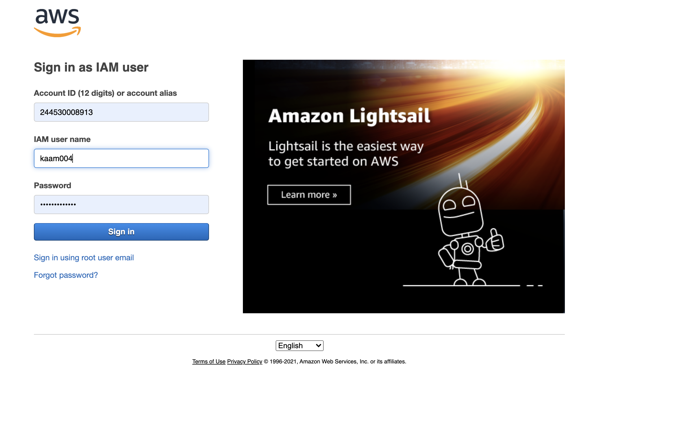
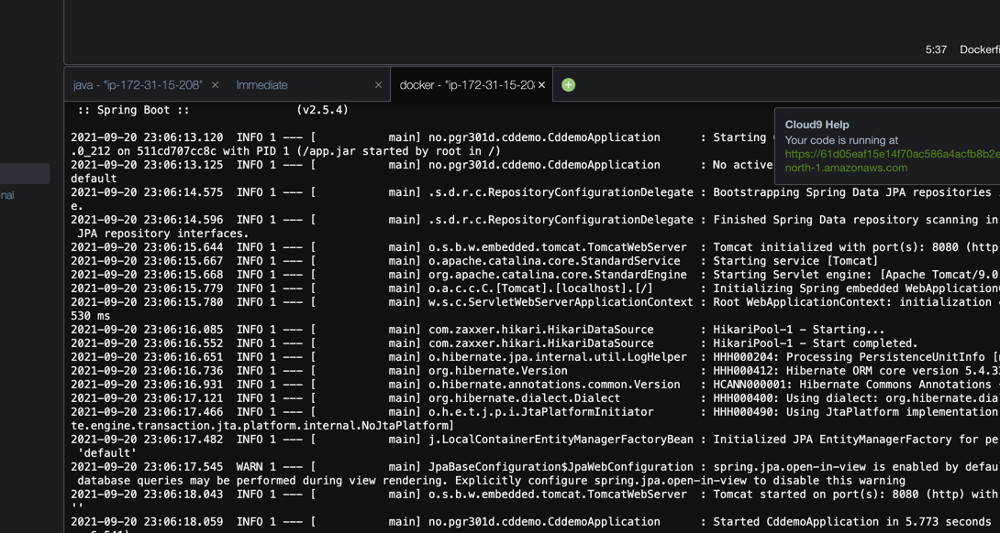

# Docker & Cloud 9

## Installer gpg (Gnu Privatcy Guard)

* https://www.gnupg.org/download/

* Last ned klassen felles privatnøkkel fra Canvas og importer denne 

```
gpg --import secret.asc
```

Se at du har importert nøkkel ved å kjøre følgende kommando
```
gpg --list-secret-keys
```

Output skal se omtrent slik ut 
```
-----------------------------------
sec   ed25519 2021-09-20 [SC] [expires: 2023-09-20]
      565076CBD1F5654153FACE76B82F2BB942F5F90A
uid           [ unknown] pgr301
ssb   cv25519 2021-09-20 [E]
```

Du kan nå dekryptere passordet til din bruker 

Windowsbrukere: 

* Bruk https://base64.guru/converter/decode/file - lim inn det krypterte passordet, og last ned filen application.bin
* Kjør 
```
gpg --decrypt application.bin
```

Osx

* Osx brukere kan gjøre base64 dekoding og fra kommandolinje. Evt kopier og lim det krypterte passordet inn i en fil 
ved hjelp av en tekst-editor.

```
  echo -n `base64 enkodet kryptert passord` | base64 --decode > encrypted_password.txt
  gpg --decrypt encrypted_password.txt
```

Du vil nå se passordet, for eksempel "9s1Lsd0#". Passordet skal være 8 tegn langt. Ignorer eventuelt % tegn på slutten av linja. 
Når du har passordet, går du til Cloud9 url for din bruker. URL skal se omtrent slik ut ; https://eu-north-1.console.aws.amazon.com/cloud9/ide/61d05eaf15e14f70ac586a4acfb8b2e0

Kontonummer skal være 244530008913. Logginn bildet skal se omtrent slik ut



# Dagens oppgave - Dockerize en Spring Boot applikasjon - og push den til docker hub

Åpne ditt Cloud 9 utviklingsmiljø, gå til terminalen og skriv 

```docker run hello-world``` 

Skal du få en output som ser slik ut ; 

```Unable to find image hello-world:latest locally
 Pulling repository hello-world
 91c95931e552: Download complete
 a8219747be10: Download complete
 Status: 
 Downloaded newer image for hello-world:latest
 Hello from Docker.
 This message shows that your installation appears to be working correctly.

 To generate this message, Docker took the following steps:
  1. The Docker Engine CLI client contacted the Docker Engine daemon.
  2. The Docker Engine daemon pulled the "hello-world" image from the Docker Hub.
     (Assuming it was not already locally available.)
  3. The Docker Engine daemon created a new container from that image which runs the
     executable that produces the output you are currently reading.
  4. The Docker Engine daemon streamed that output to the Docker Engine CLI client, which sent it
     to your terminal.

 To try something more ambitious, you can run an Ubuntu container with:
  $ docker run -it ubuntu bash

 For more examples and ideas, visit:
  https://docs.docker.com/userguide/

```

Først må vi installere Maven i Cloud9
```
sudo wget http://repos.fedorapeople.org/repos/dchen/apache-maven/epel-apache-maven.repo -O /etc/yum.repos.d/epel-apache-maven.repo
sudo sed -i s/\$releasever/6/g /etc/yum.repos.d/epel-apache-maven.repo
sudo yum install -y apache-maven
```

Vi må også oppgradere til Java 8

```
sudo yum -y install java-1.8.0-openjdk-devel
```

Vi må få Operativsystemet til å bruke den siste versjon av Java
```
sudo update-alternatives --config java
sudo update-alternatives --config javac
```

Vi skal nå bruke Cloud9 miljøet til å lage et Docker image av en enkel Spring Boot applikasjon

* Klon dette repositoriet inn i ditt cloud9 miljø med 

```
git clone https://github.com/PGR301-2021/04-cd-part-2.git
cd 04-cd-part-2
```

Test at du kan bygge og kjøre applikasjonen med 

```
mvn spring-boot:run
```
Sjekk at applikasjonen kjører ved å bruke curl i et nytt terminalvindu (Se etter et "+" tegn)


Kjør kommandoen
```
curl localhost:8080                                                                                                            
```
Og set at applikasjonen svare med "Hello"

Stopp applikasjonen (Control +C) 

For å lage en Docker Container av Spring Boot applikasjonen din må du lage en Dockerfile. Lag en fil som heter
Dockerfile i samme katalog som pom.xml og kopier innholdet

```dockerfile
FROM openjdk:8-jdk-alpine
VOLUME /tmp
ARG JAR_FILE
COPY ${JAR_FILE} app.jar
ENTRYPOINT ["java","-jar","app.jar"]
```

For å bruke Docker til å lage et Container Image kjører dere; 
```sh
docker build . --tag pgr301 --build-arg JAR_FILE=./target/cddemo-0.0.1-SNAPSHOT.jar 
```

* Tag gir container image et mer brukervennlig navn. 
* build arg sender en parameter til Dockerfile

Etter docker har bygget et container image, kan dere starte en Container med  

```sh
docker run pgr301:latest
```

Legg merke til latest. Vi kan bruke den syntaksen for å starte den siste versjonen av et container image. 
Vent litt. Dette fungerte jo ikke; dere må eksponere port 8080 fra Containeren på maskinen din! Dette kalles port mapping. 

```bash
 docker run -p 8080:8080 pgr301:latest
 ```

Sjekk at applikasjonen kjører ved å bruke curl i et nytt terminalvindu

```
curl localhost:8080                                                                                                            
Hello
kaam004:~/environment $ 
```

# Docker hub
 
Docker hub er en tjeneste som gjør det mulig å lagre container images sentralt, og dele disse med hele verden - eller bare et prosjekt eller team/organisasjon. 
For å fullføre denne labben må dere registrere dere på Dockerub. Dere skal deretter bygge et container images lokalt - og "pushe" dette til Docker Hub.

## Registrer deg som bruker på Docker Hub

https://hub.docker.com/signup

## Bygg container image og push til docker hub

Ved docker login så benytter du brukernavn og passord på Docker hub
```
docker login
docker tag <tag> <username>/<tag_remote>
docker push <username>/<tag_remote>
```

Eksempel

```
docker login
docker tag fantasticapp glennbech/fantasticapp
docker push glennbech/fantasticapp
```

Verdien <tag> er altså en *tag* som du bestemte deg for når du gjorde docker build (pgr301:latest for eksempel). <tag_remote> kan du bestemme deg for nå, fordi det er verdien som 
skal brukes for docker hub. 

## Del på Canvas Chat

Når dere har pushet container image til Docker Hub - del navnet på slack (brukernavn/image) - og forsøk å kjøre andre sine images slik 
Endre gjerne litt på koden for å gjøre den litt mer interessant, eller si "Hei fra ditt navn".

```
 docker run -p 8080:8080 glennbech/pgr301
```

# Liste over Docker kommandoer dere kommer til å trenge;

* docker tag
* docker build - lager docker image basert på docker files
* docker ps - hva kjører?
* docker images - hva har jeg bygget ?
* docker run - start en container (fra et image)
* docker logs - se på loggen fra en container
* docker exec --it <image> bash - "logge inn" i en container for å se hva som skjer for debug (inception)

Bonusoppgaver; 

- Se på terraform som kommer snart...  https://learn.hashicorp.com/tutorials/terraform/install-cli